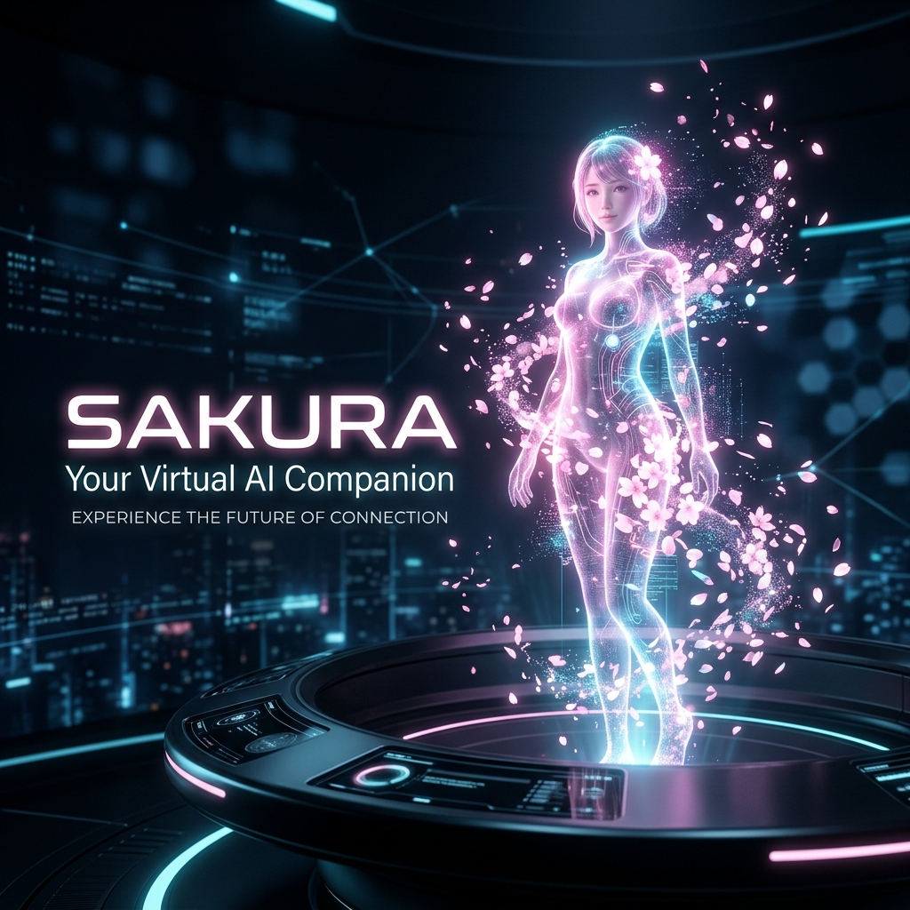
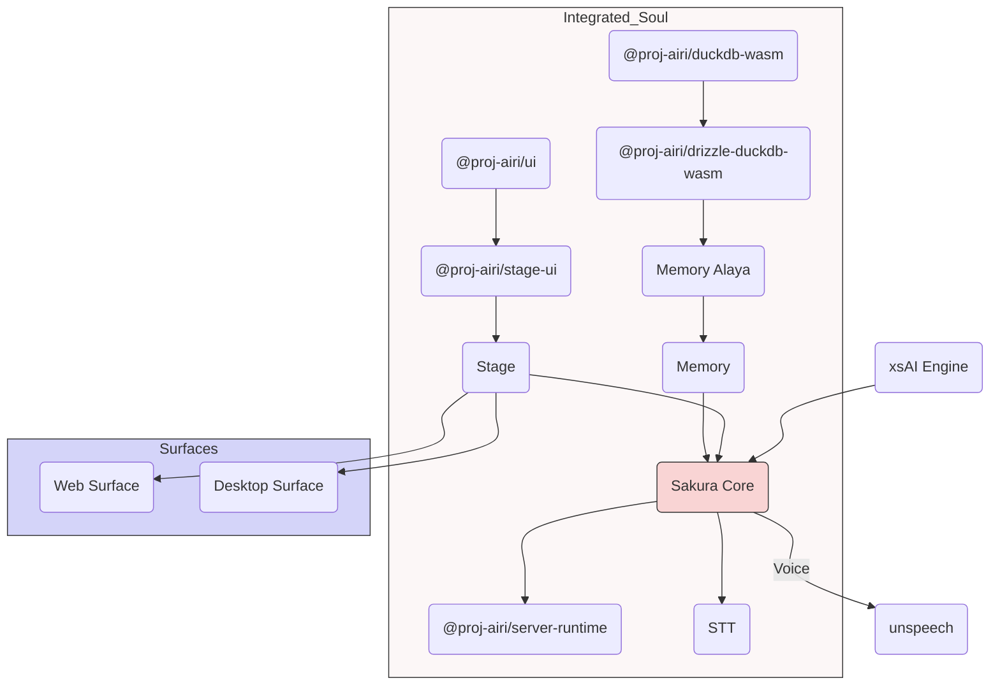

# Project Sakura: Virtual AI Companion



<p align="center">
  <strong>A premium, state-of-the-art virtual AI companion built for personal interaction, gaming, and companionship.</strong>
</p>

---

## 🌟 The Vision

Project Sakura is a sophisticated orchestration of AI technologies designed to bring a digital soul into your world. Whether it's playing games, assisting with code, or simply being a steady companion, Sakura is built to be a living part of your digital life.

---

## 🚀 Core Ecosystem

Sakura is composed of several high-performance modules that work in harmony to create a seamless experience.

### 🧠 The Brain (Intelligence)
Sakura's cognitive core handles logic, memory, and specialized skills.
- **Gaming Integrations**: Fully capable of playing **Minecraft** and **Factorio**.
- **Social Connectivity**: Integration with **Discord** and **Telegram**.
- **Memory System**: Powered by pure in-browser databases (DuckDB WASM / pglite) and [WIP] Memory Alaya for persistent context.

### 💃 The Body (Visual Presence)
Sakura communicates through a modern, expressive interface.
- **VRM & Live2D Support**: Full control over 3D and 2D models.
- **Natural Animations**: High-fidelity auto-blinking, focus tracking (look-at), and idle eye/body movements.
- **Multi-Surface**: Optimized for Web, Desktop (Electron), and Mobile (Capacitor).

### 👂 The Senses (Input)
Sakura understands your world in real-time.
- **Audio Intelligence**: Advanced talking detection and client-side speech recognition.
- **Multimodal Senses**: Capable of processing browser input and Discord voice channels.

### 👄 The Voice (Output)
Sakura speaks with clarity and personality.
- **Synthesized Voice**: Crystal-clear voice generation powered by **ElevenLabs** and other modern TTS engines.

---

## 🛠️ Multi-Platform Deployment

Run Sakura exactly how you want it, on any device.

### 🌐 Stage Web (Browser)
The ultimate browser-based experience. Access Sakura anywhere.
```shell
pnpm i
pnpm dev
```

### 💻 Stage Tamagotchi (Desktop)
The premium desktop experience with native performance.
```shell
pnpm dev:tamagotchi
```

### 📱 Stage Pocket (Mobile)
Take Sakura everywhere you go.
```shell
pnpm dev:pocket
```

---

## ⚙️ Technical Architecture

Sakura is built on a foundation of modern web technologies, ensuring performance and scalability.



### 🏁 Powered By
- **Frontend**: Vue 3, Vite, UnoCSS (for sleek, responsive design).
- **Backend/IPC**: Electron (for desktop), Eventa (for type-safe communication).
- **AI Core**: `xsai` for multi-provider LLM support (Gemini, Claude, GPT, Ollama, and more).
- **Graphics**: WebGPU & Three.js for stunning visuals.

---

> [!TIP]
> **Pro Tip:** For the best performance on desktop, use the Tamagotchi stage to leverage native CUDA/Metal acceleration via the candle-powered backend.
